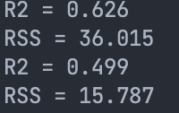
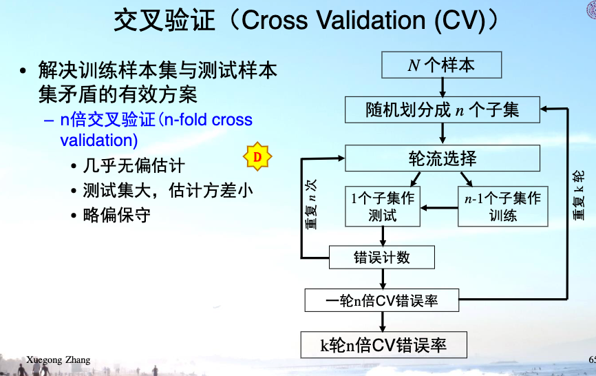
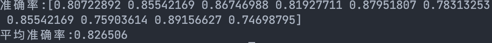
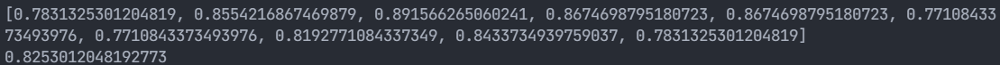

### 3.5 小实验1：线性回归练习

（1）不考虑交叉项，根据编程代码可得**prostate_train.txt**线性回归结果为：$\left(\mathrm{R}^{2}, \mathrm{RSS}\right) = (0.626, 36.015)$，对**prostate_test.txt**进行预测，结果评价为：$\left(\mathrm{R}^{2}, \mathrm{RSS}\right) = (0.499, 15.787)$

（2）考虑交叉项可能会有更好的效果，在现实中，两个因素可能不会单独作用于一个病理结果，可能是共同作用，相互影响，因此加入交叉项可以从更多的维度上考虑解决问题的模型。

### 3.6 小实验2：线性分类器练习

**本题的缺失值处理方式**是：手写一个函数（见代码包）将含缺失值的行删去

十折交叉验证法如下：

（1）使用**logistics**回归法，回归函数如下：
$$
f(x) = \frac{1}{e^{-x} + 1}
$$
调用sklearn的工具包，并使用十折交叉验证可以拟合出准确率和平均准确率如下：

（2）使用**Fisher**判别式法则（纯手写，代码见附件），$\omega$方向如下，为了保证结果合理，我在实际代码中将系数扩大了25倍：
$$
\boldsymbol{w}^{*} \propto \boldsymbol{S}_{w}^{-1}\left(\boldsymbol{m}_{1}-\boldsymbol{m}_{2}\right)
$$
​		选取$\omega_0$的方法是：
$$
\omega_0 = -\frac{N_1*\tilde{m}_{1}+N_2*\tilde{m}_{2}}{N}
$$

调用sklearn的工具包，并使用十折交叉验证可以拟合出准确率和平均准确率如下：

使用十折交叉验证可以拟合出准确率为，平均准确率为：

综上可以看出，两者方法差别不大，需要根据实际数据特点选取方法。
