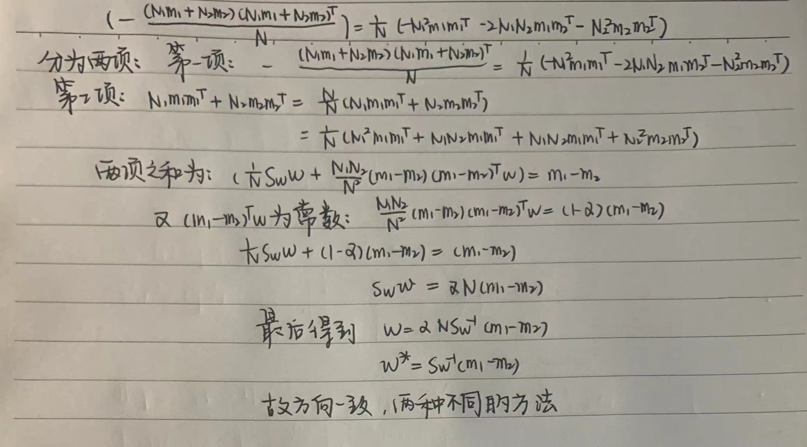

3.1 本证明参考课程ppt的大致证明，Fisher准则如下：
$$
\max _{w} J_{F}(w)=\frac{\left(\tilde{m}_{1}-\tilde{m}_{2}\right)^{2}}{\tilde{S}_{1}+\tilde{S}_{2}}\\
$$
​		又
$$
\tilde{m}_{1}-\tilde{m}_{2} =\frac{1}{N_{1}} \sum_{y_{j} \in Y_{1}} y_{j} - \frac{1}{N_{2}} \sum_{y_{j} \in Y_2} y_{j} = \frac{1}{N_{1}} \sum_{x \in D_1} w^Tx - \frac{1}{N_{2}} \sum_{x \in D_2} w^Tx = w^Tm_1 - w^Tm_2\\
\left(\tilde{m}_{1}-\tilde{m}_{2}\right)^{2} = |w^T(m_1-m_2)|^2 = w^T(m_1 - m_2)(m_1-m_2)^Tw = w^T S_bw\\
\begin{aligned}
\tilde{S}_{1}+\tilde{S}_{2} 
& = \sum_{y_{j} \in y_{1}}\left(y_{j}-\tilde{m}_{1}\right)\left(y_{j}-\tilde{m}_{1}\right)^{T} + \sum_{y_{j} \in y_{2}}\left(y_{j}-\tilde{m}_{2}\right)\left(y_{j}-\tilde{m}_{2}\right)^{T} \\
& =\sum_{x \in D_{1}}\left(w^Tx-w^Tm_1\right)\left(w^Tx-w^Tm_1\right)^{T} + \sum_{x \in D_{2}}\left(w^Tx-w^Tm_2\right)\left(w^Tx-w^Tm_2\right)^{T}  \\
& = \sum_{x \in D_{1}} w^{T}\left(x-m_{1}\right)\left(x-m_{1}\right)^{T} w+\sum_{x \in D_{2}} w^{T}\left(x-m_{2}\right)\left(x-m_{2}\right)^{T} w = w^TS_ww
\end{aligned}
$$
​		于是Fisher准则可以化为：
$$
J_{F}(\boldsymbol{w})=\frac{\boldsymbol{w}^{T} \boldsymbol{S}_{b} \boldsymbol{w}}{\boldsymbol{w}^{T} \boldsymbol{S}_{w} \boldsymbol{w}}
$$
​		不妨令分母 $\boldsymbol{w}^{T} \boldsymbol{S}_{w} \boldsymbol{w}=c \neq 0$, 最大化分子 $\boldsymbol{w}^{T} \boldsymbol{S}_{b} \boldsymbol{w}$，即：
$$
\max \boldsymbol{w}^{T} \boldsymbol{S}_{b} \boldsymbol{w}\\
s.t. \boldsymbol{w}^{T} \boldsymbol{S}_{w} \boldsymbol{w}=c
$$
​		使用拉格朗日乘子法可得：$L(\boldsymbol{w}, \lambda)=\boldsymbol{w}^{T} \boldsymbol{S}_{b} \boldsymbol{w}-\lambda\left(\boldsymbol{w}^{T} \boldsymbol{S}_{w} \boldsymbol{w}-c\right)$，优化此函数得到：

​		Fisher线性判别最优投影方向为$w^{*} \propto S_{w}^{-1}\left(m_{1}-m_{2}\right)$

3.2  首先解释名词含义：参考百度百科

- **误差平方和**：误差平方和是根据n个观察值拟合适当的模型后，余下未能拟合部份称为**残差**，其中y平均表示n个观察值的平均值，所有n个残差平方之和称**误差平方和**。**作用**：衡定模型拟合效果的好坏，SSE越小说明模型拟合的效果越好。

- **决定系数（$R^2$）**：对于单变量回归，即为$R^{2}=\frac{\operatorname{Cov}(X, Y)}{S_{X} S_{Y}}$。对于多变量回归，$R^{2}=\frac{S S R}{S S T}=1-\frac{S S E}{S S T}$

  其中，
  $$
  \begin{aligned}
  &S S T=\sum_{i=1}^{n}\left(y_{i}-\bar{y}\right)^{2} \\
  &S S R=\sum_{i=1}^{n}\left(\hat{y}_{i}-\bar{y}\right)^{2}
  \end{aligned}
  $$
  **作用**：决定了模型的拟合效果，当决定系数取得最大值1的时候，说明模型拟合最好。

- **MAE 和 MAPE**：MAE是平均绝对误差，表示为$MAE=\frac{1}{n} \sum_{i-1}^{n}\left|\hat{y}_{i}-y_{i}\right|$，MAPE是平均绝对百分比误差，$M A P E=\frac{100 \%}{n} \sum_{i=1}^{n}\left|\frac{\hat{y}_{i}-y_{i}}{y_{i}}\right|$，**作用**：用于衡量模型拟合的好坏，MAE越小拟合效果越好，当MAPE为0时，大于100%时说明模型有问题。

- **MSE 和 RMSE**：MSE是均方误差，是参数估计值与参数真值之差平方的期望值：$M S E=\frac{1}{n} \sum_{i=1}^{n}\left(\hat{y}_{i}-y_{i}\right)^{2}$。RMSE是均方根误差，即MSE的算术平方根：$R M S E=\sqrt{M S E}$

  作用：用于衡量模型拟合效果的好坏，相比于其他系数消除了数据个数对于大小的影响，MSE越小说明拟合效果越好。

回归系数最能体现模型的准确性。

证明：

查阅[百度百科](https://baike.baidu.com/item/Pearson%E7%9B%B8%E5%85%B3%E7%B3%BB%E6%95%B0/6243913)等网站可得皮尔森相关系数为：
$$
r=\frac{N \sum x_{i} y_{i}-\sum x_{i} \sum y_{i}}{\sqrt{N \sum x_{i}^{2}-\left(\sum x_{j}\right)^{2}} \sqrt{N \sum y_{i}^{2}-\left(\sum y_{i}\right)^{2}}}
$$
又，
$$
R^{2}=\frac{S S R}{S S T}=\frac{\sum_{i=1}^{n}\left(\widehat{y}_{\imath}-\bar{y}\right)^{2}}{\sum_{\{i=1}^{n}\left(y_{i}-\bar{y}\right)^{2}}
$$
代入：
$$
\widehat{y_{2}}=\widehat{\beta_{0}}+\widehat{\beta_{1}} x_{i}\\
\bar{y}=\widehat{\beta_{0}}+\widehat{\beta_{1} \bar{x}}\\
\widehat{\beta_{1}}=\frac{N \sum x_{i} y_{i}-\sum x_{i} \sum y_{i}}{N \sum x_{i}^{2}-\left(\sum x_{i}\right)^{2}}\\
$$
代入可得：
$$
R^{2}=\frac{\sum_{i=1}^{n}\left(\widehat{\beta_{1}}\right)^{2}\left(x_{i}-\bar{x}\right)^{2}}{\sum_{i=1}^{n}\left(y_{i}-\bar{y}\right)^{2}}=\left(\frac{N \sum x_{i} y_{i}-\sum x_{i} \sum y_{i}}{N \sum x_{i}^{2}-\left(\sum x_{i}\right)^{2}}\right)^{2} \frac{\sum_{i=1}^{n}\left(x_{i}-\bar{x}\right)^{2}}{\sum_{i=1}^{n}\left(y_{i}-\bar{y}\right)^{2}} \\
=\frac{N \sum x_{i} y_{i}-\sum x_{i} \sum y_{i}}{\left(N \sum x_{i}^{2}-\left(\sum x_{i}\right)^{2}\right)\left(N \sum y_{i}^{2}-\left(\sum y_{i}\right)^{2}\right)}=r^{2}
$$
3.3 **以下证明参考了https://blog.csdn.net/perryre/article/details/53678128**

3.4 **以下证明参考了课件** 

罗杰思特回归需要优化的是最大似然函数：$L(\boldsymbol{w})=\prod_{j=1}^{N} P\left(y_{j} \mid \boldsymbol{x}_{j}\right)=\prod_{j=1}^{N} \theta\left(y_{j} \boldsymbol{w}^{T} \boldsymbol{x}_{j}\right)$

等价于优化：
$$
\begin{aligned}
E(w)
& =-\frac{1}{N} \ln (L(w))=-\frac{1}{N} \ln \left(\prod_{j=1}^{N} \theta\left(y_{j} w^{T} x_{j}\right)\right)\\
& =\frac{1}{N} \sum_{j=1}^{N} \ln \left(1+e^{-y_{j} w^{T} x_{j}}\right)
\end{aligned}
$$
求梯度
$$
\begin{aligned}
\nabla E 
& = \frac{1}{N} \sum_{j=1}^{N}\nabla\left( \ln \left(1+e^{-y_{j} w^{T} x_{j}}\right)\right)\\
& = \frac{1}{N} \sum_{j=1}^{N}\frac{e^{-y_{j}w^T x_{j}}}{1+e^{-y_{j} w^T x_{j}}}y_{j} x_{j}\\
& = -\frac{1}{N} \sum_{j=1}^{N} (\frac{1}{1+e^{y_{j} w^{T} x_{j}}}) y_{j} x_{j}\\
\end{aligned}\\
$$
