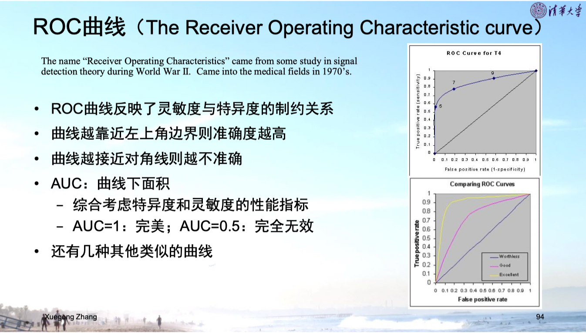

## 2.1 错误率的评价--错误率的定义和计算

### 错误率

- 训练错误率、测试错误率、真实错误率

- 测试错误率:
  $$
  \hat{\varepsilon}=k / N
  $$

- 需要大量样本以获得准确可靠的估计

### 交叉验证

**留一法交叉验证、自举法与B.632估计**

## 2.2 错误率、准确率、正确率

- 重要术语

  

### 两类错误率

- 计算例子

  

- 计算

  

## 2.3 ROC曲线

- 介绍

  

## 2.4 用分类推断关系

