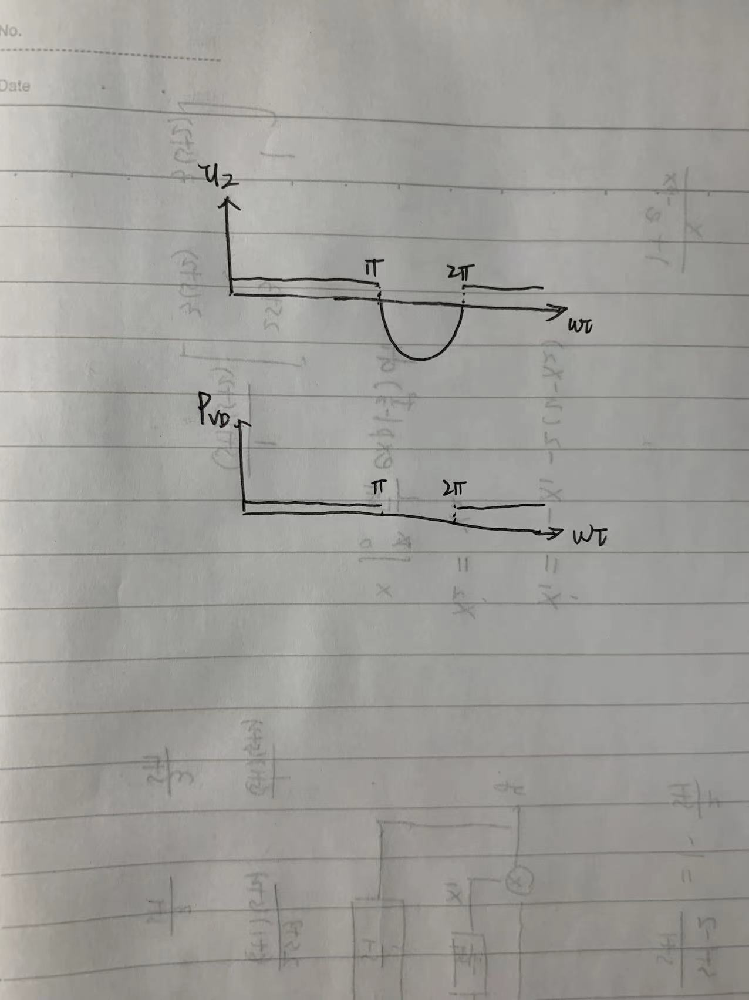
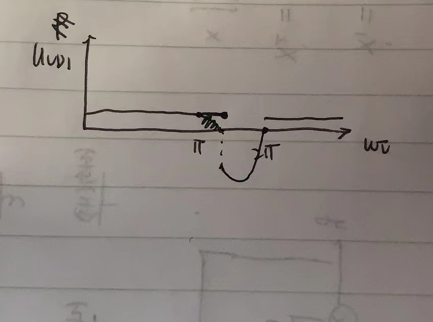

1. （1）从电力MOSFET的特性表可以看出，在饱和区（通态），输出电流$i_D$和$u_{GS}$呈正比，即通态压降

   与电流成正比。

   （2）

2. （1）

   ​		$u_{VD1}$波形如上图，$VD$的功率损耗波形如下图

   （2）电感不会马上使电流变为0，因此在输入电压变为负值时，$u_d$出现负值。

   ​			

   ​			上图是$u_{VD1}$的波形

3. 不会

4. （1）$u_{CES}$（2）$I_c$（3）还需开通下降时间，该参数描述了IGBT在开通过程中电压下降所需要的时间。

   （2）大于800V

5. （**附加题**）
