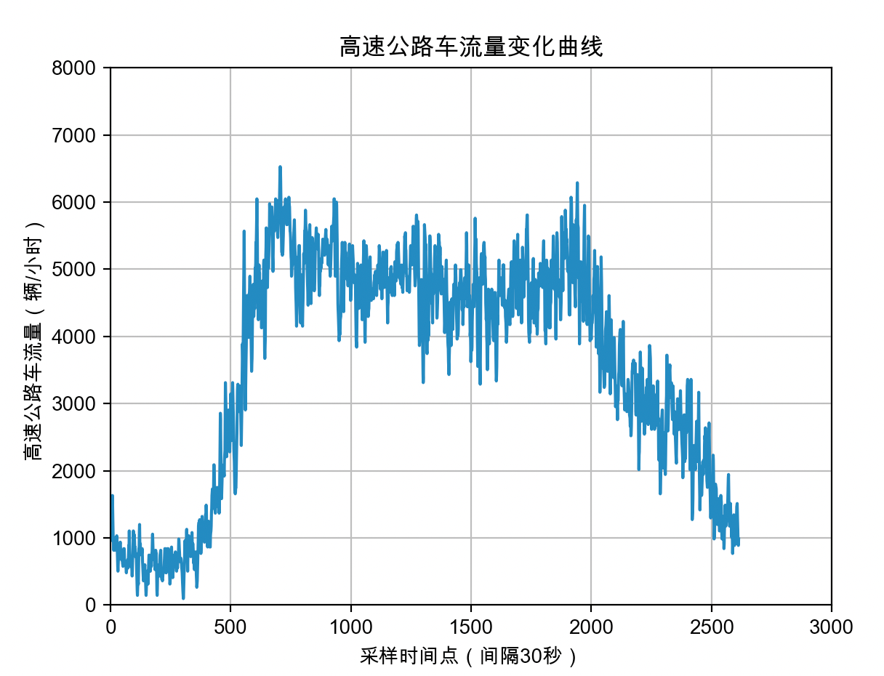
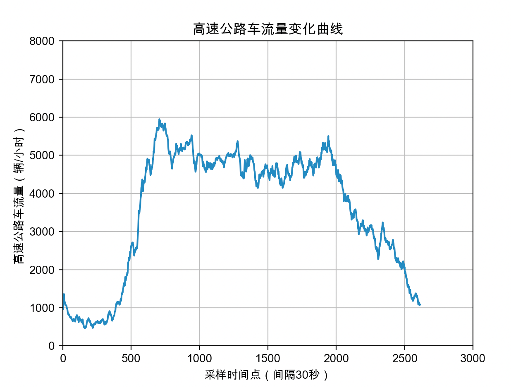
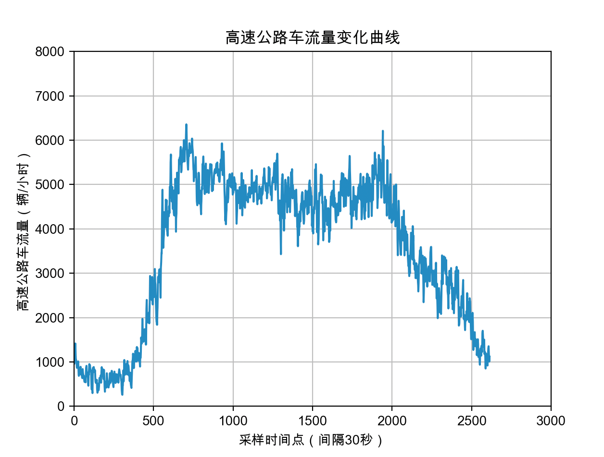
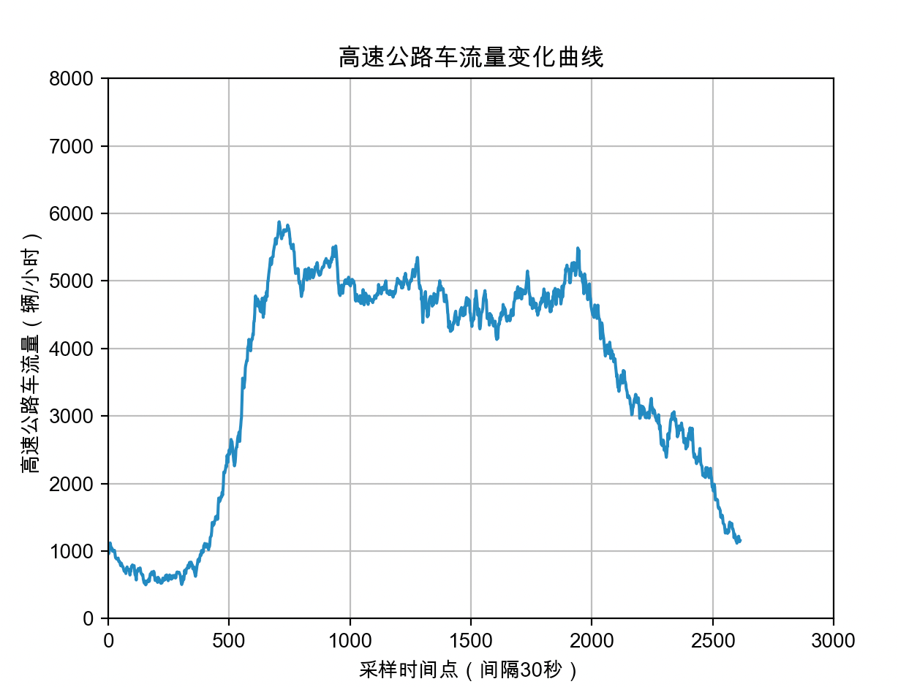
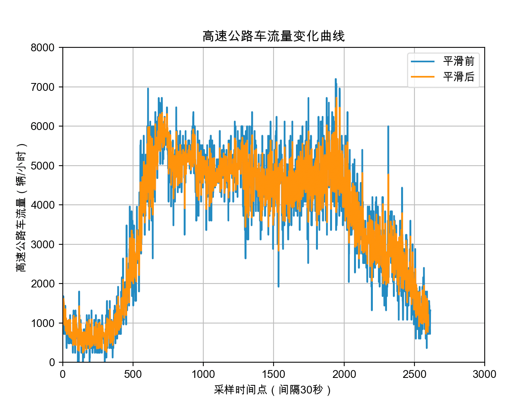

# 系统工程导论第一次作业

<center>何东阳 2019011462 自96</center>

## 第一问 数据可视化


## 第二问 移动平均法

​	移动平均法对于消除数据的随机波动，从而显示出数据的周期性和未来发展规律，达到比较好的预测效果。一般而言，是对前N个数据单独处理，使用移动平均，从第N个开始，使用卷积计算N项平均数。代码如下：

```python
# 移动平均法
def MA(y, N):
    ans = np.convolve(y, np.ones(N) / N)
    sum = 0
    for i in range(N):
        sum += y[i]
        ans[i] = sum / (i + 1)
    return ans[0:len(y)]
```




<center>N = 5</center>



<center>N = 30</center>

## 第三问 指数平均法

​	指数平均法是基于移动平均法发展起来的时序预测方法，计算的是数据的指数平均值，与本次观察值和上一次观察值有关：
$$
\hat{Y_{t+1}}=\alpha Y_{t}+(1-\alpha) \hat{Y}_{t}, \quad 0<\alpha<1
$$
代码如下：

```python
# 指数平均法
def EMA(y, alpha):
    ans = [0] * len(y)
    ans[0] = y[0]
    y_hat = ans[0]
    for i in range(1, len(y)):
        ans[i] = alpha * y[i] + (1 - alpha) * y_hat
        y_hat = ans[i]
    return ans
```


$$
\alpha = 0.2
$$

$$
\alpha = 0.05
$$

## 第四问 两种方法的增量形式推导

1. 移动平均法的增量形式
   $$
   \Delta S_{t}=S_{t}-S_{t-1}=\frac{1}{N}\left(A_{t-1}+\ldots+A_{t-N}\right)-\frac{1}{N}\left(A_{t-2}+\ldots+A_{t-N-1}\right)=\frac{1}{N}\left(A_{t-1}-A_{t-N-1}\right)
   $$

2. 指数平均法的增量形式
   $$
   \Delta Y_{t}=Y_{t}-Y_{t-1}=\alpha \cdot y_{t}+(1-\alpha) \cdot Y_{t-1}-\alpha \cdot y_{t-1}-(1-\alpha) \cdot Y_{t-2}=\alpha \cdot \Delta y_{t}+(1-\alpha) \cdot \Delta Y_{t-1}
   $$

## 第五问 ARIMA方法

​	**ARIMA**方法中文是**差分自回归移动平均模型**，模型简单，是一种统计学里常用的时序预测模型。公式定义如下：p是自回归项数，q是移动平均项数，d为时间序列成为平稳序列需要的差分次数。
$$
y_{t}=\mu+\epsilon_{t}+\sum_{i=1}^{q} \theta_{i} \epsilon_{t-i}+\sum_{i=1}^{p} \gamma_{i} y_{t-i}
$$
​	此题中我们选择参数为$p = 8, d = 0, q = 7$，代码如下：

```python
def ARIMA(y):
    data = pd.DataFrame({"流量": y})
    predicts = sm.tsa.ARIMA(data, order=(8, 0, 7)).fit()
    predict_sunspots = predicts.predict(start=1, end=2600, dynamic=False)
    _, ax = plt.subplots(figsize=(12, 8))
    ax = data.plot(ax=ax)
    predict_sunspots.plot(ax=ax)
    plt.xlabel("采样时间点（间隔30秒）")
    plt.ylabel("高速公路车流量（辆/小时）")
    plt.legend(['平滑前', '平滑后'])
    plt.title("高速公路车流量变化曲线")
    plt.xlim((0, 3000))
    plt.ylim((0, 8000))
    plt.grid()
    plt.show()
```



可以从结果看出，使用ARIMA后，时序数据变得更加平滑，更能突出原来数据的变化特性，有助于我们分析理解。

## 总结

本次作业一共采用了三种时序分析方法，经过这三种方法，可以看出高速公路的流量曲线大致呈现先增，后平缓，再减的趋势。可以看出这三种方法中移动平均法的可视化最清晰，指数平均法第二，ARIMA方法可视化相对没有那么清晰（可能是参数选择的问题），但更好的还原了原来的数据。
